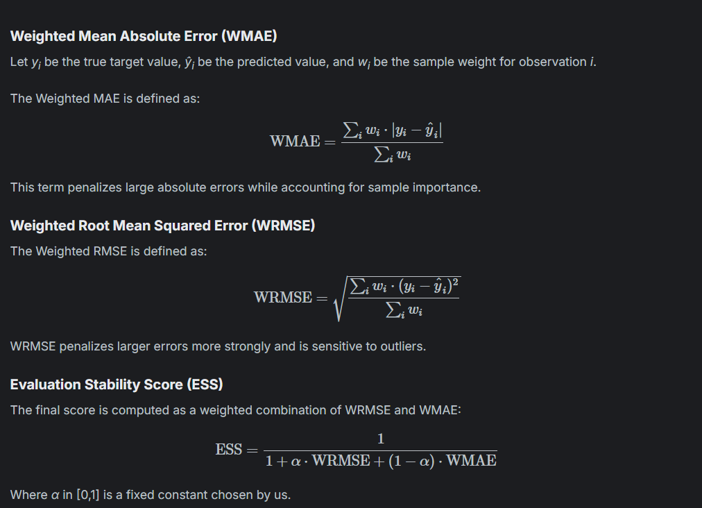
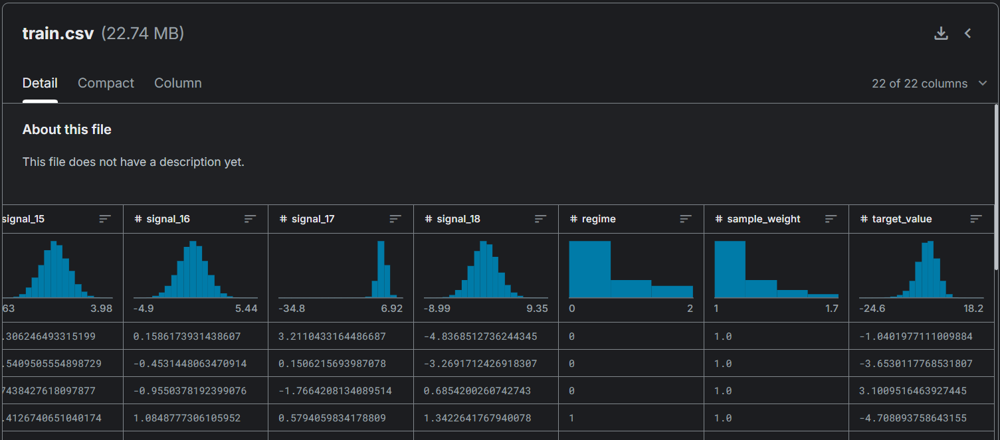
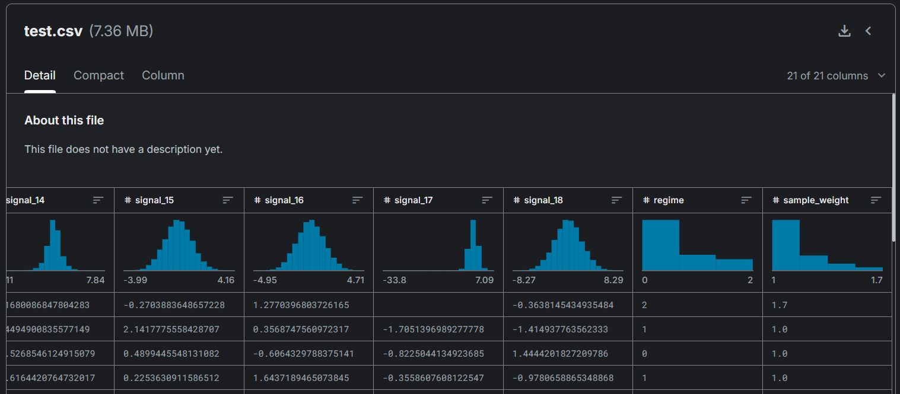
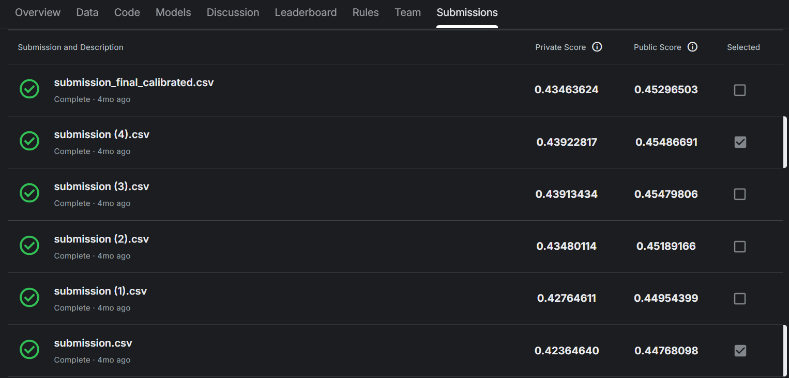
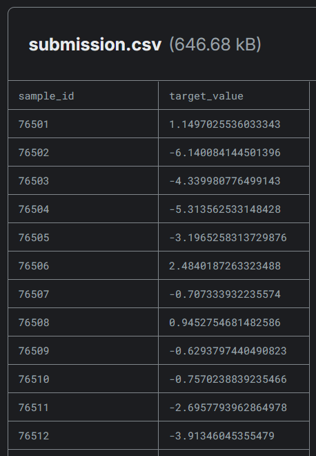
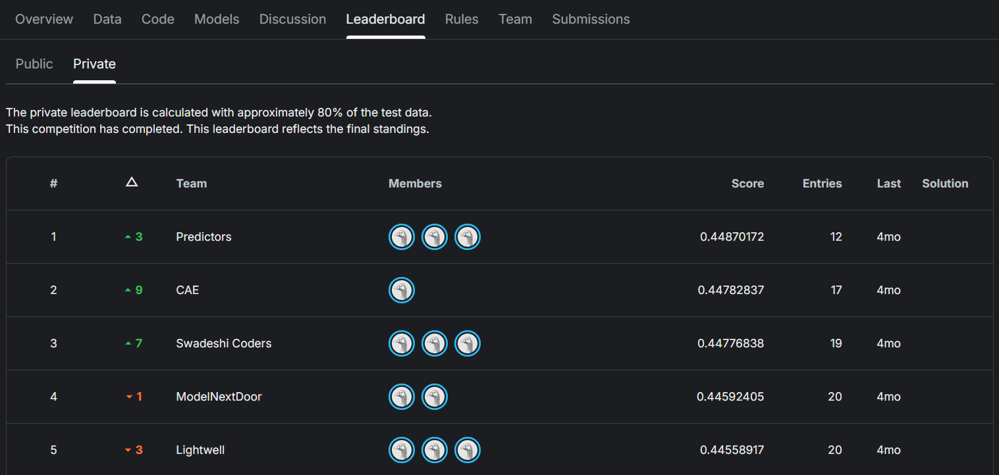
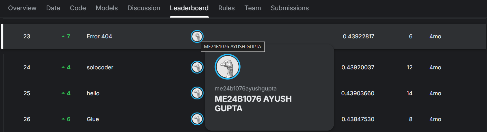

# Regression_signals093
Built a regression model with 18 numerical features/signals and 3 regimes/categories with sample_weights, noise, and missing data.

## Libraries used
numpy, pandas, sklearn, xgboost, lightgbm 

## Approach

* Performed 5-fold cross-validation.
* Trained XGBoost and LightGBM models across 5 seeds.
* Took the average values to improve robustness and reduce variance.

## Evaluation
The evaluation metric combines **Weighted Root Mean Squared Error (WRMSE)** and **Weighted Mean Absolute Error (WMAE)** into a single bounded score called the **Evaluation Stability Score (ESS).**

*Higher scores indicate better model performance.*

### Key properties of ESS:

* Bounded between 0 and 1
* Higher is better
* Penalizes both large and consistent errors
* Rewards models that generalize well across difficult samples

## Data

### train.csv

### test.csv

## My submissions

### All submissions

### submission.csv

## Leaderboard

## Result

* Achieved an ESS score of **0.45486691** with rank of **30/58** on the public leaderboard (20% data).

* Achieved an ESS score of **0.43922817** with rank of **23/58** on the private leaderboard (other 80% data).
